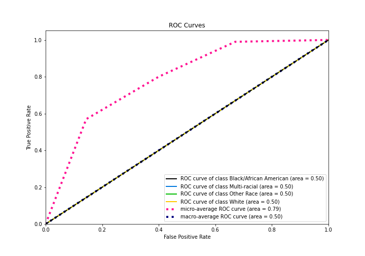

# Summary of 1_Baseline

[<< Go back](../README.md)

## Baseline Classifier (Baseline)
- **n_jobs**: -1
- **num_class**: 4
- **explain_level**: 2

## Validation
 - **validation_type**: split
 - **train_ratio**: 0.75
 - **shuffle**: True
 - **stratify**: True

## Optimized metric
logloss

## Training time

0.8 seconds

### Metric details
|           |   Black/African American |   Multi-racial |   Other Race |       White |   accuracy |   macro avg |   weighted avg |   logloss |
|:----------|-------------------------:|---------------:|-------------:|------------:|-----------:|------------:|---------------:|----------:|
| precision |                        0 |              0 |            0 |    0.569652 |   0.569652 |    0.142413 |       0.324503 |    1.0208 |
| recall    |                        0 |              0 |            0 |    1        |   0.569652 |    0.25     |       0.569652 |    1.0208 |
| f1-score  |                        0 |              0 |            0 |    0.725832 |   0.569652 |    0.181458 |       0.413471 |    1.0208 |
| support   |                      838 |             45 |         1020 | 2519        |   0.569652 | 4422        |    4422        |    1.0208 |

## Confusion matrix
|                                   |   Predicted as Black/African American |   Predicted as Multi-racial |   Predicted as Other Race |   Predicted as White |
|:----------------------------------|--------------------------------------:|----------------------------:|--------------------------:|---------------------:|
| Labeled as Black/African American |                                     0 |                           0 |                         0 |                  838 |
| Labeled as Multi-racial           |                                     0 |                           0 |                         0 |                   45 |
| Labeled as Other Race             |                                     0 |                           0 |                         0 |                 1020 |
| Labeled as White                  |                                     0 |                           0 |                         0 |                 2519 |

## Learning curves

## Confusion Matrix

## Normalized Confusion Matrix

## ROC Curve

## Precision Recall Curve

[<< Go back](../README.md)
