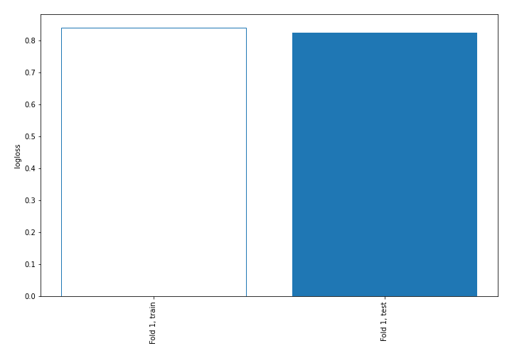
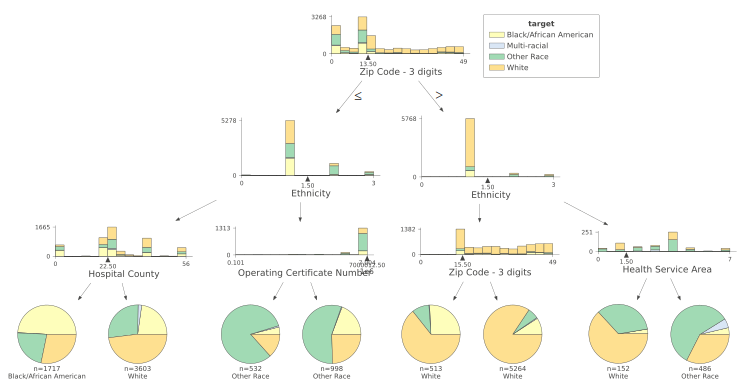
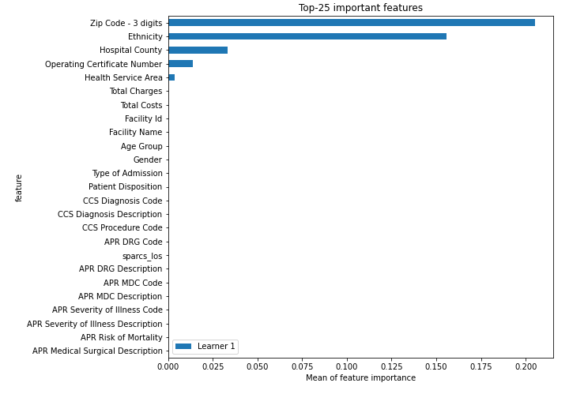
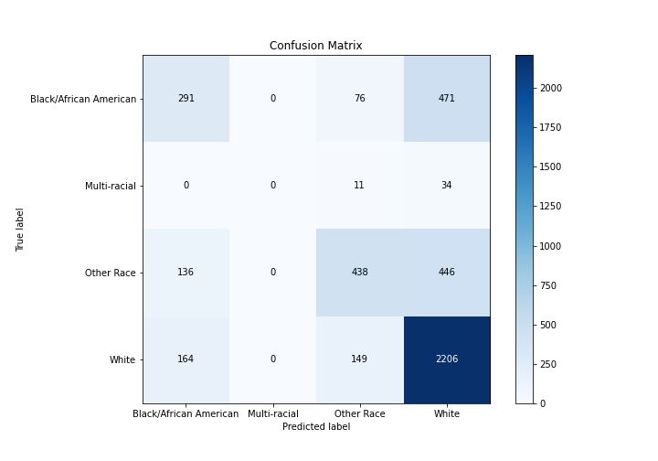
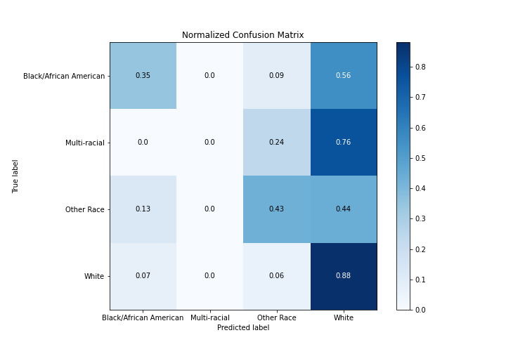
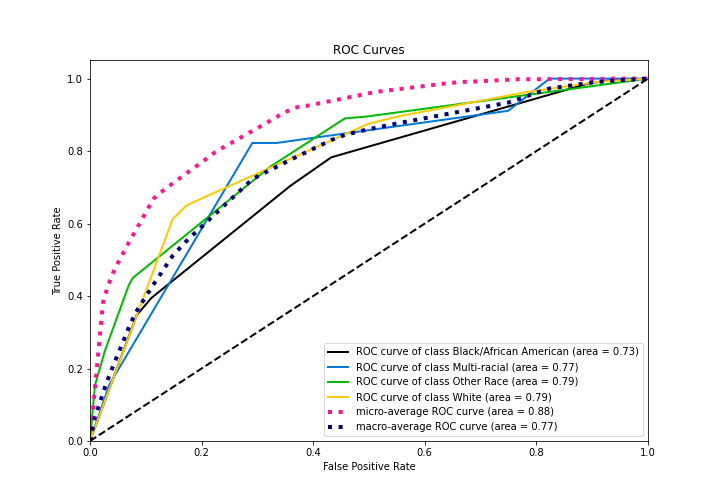
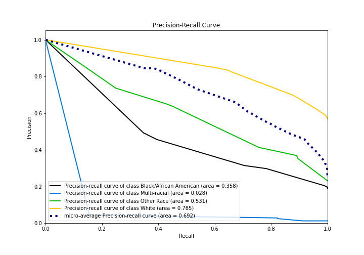
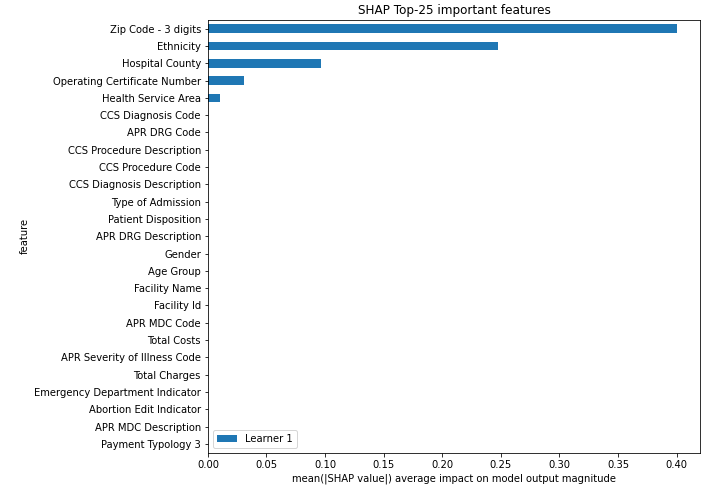

# Summary of 2_DecisionTree

[<< Go back](../README.md)

## Decision Tree
- **n_jobs**: -1
- **criterion**: gini
- **max_depth**: 3
- **num_class**: 4
- **explain_level**: 2

## Validation
 - **validation_type**: split
 - **train_ratio**: 0.75
 - **shuffle**: True
 - **stratify**: True

## Optimized metric
logloss

## Training time

17.4 seconds

### Metric details
|           |   Black/African American |   Multi-racial |   Other Race |       White |   accuracy |   macro avg |   weighted avg |   logloss |
|:----------|-------------------------:|---------------:|-------------:|------------:|-----------:|------------:|---------------:|----------:|
| precision |                 0.492386 |              0 |     0.649852 |    0.698765 |   0.663727 |    0.460251 |       0.641261 |  0.824643 |
| recall    |                 0.347255 |              0 |     0.429412 |    0.875744 |   0.663727 |    0.413103 |       0.663727 |  0.824643 |
| f1-score  |                 0.407278 |              0 |     0.517119 |    0.777308 |   0.663727 |    0.425426 |       0.639258 |  0.824643 |
| support   |               838        |             45 |  1020        | 2519        |   0.663727 | 4422        |    4422        |  0.824643 |

## Confusion matrix
|                                   |   Predicted as Black/African American |   Predicted as Multi-racial |   Predicted as Other Race |   Predicted as White |
|:----------------------------------|--------------------------------------:|----------------------------:|--------------------------:|---------------------:|
| Labeled as Black/African American |                                   291 |                           0 |                        76 |                  471 |
| Labeled as Multi-racial           |                                     0 |                           0 |                        11 |                   34 |
| Labeled as Other Race             |                                   136 |                           0 |                       438 |                  446 |
| Labeled as White                  |                                   164 |                           0 |                       149 |                 2206 |

## Learning curves

## Decision Tree 

### Tree #1

### Rules

if (Zip Code - 3 digits > 13.5) and (Ethnicity <= 1.5) and (Zip Code - 3 digits > 15.5) then class: White (proba: 84.35%) | based on 5,264 samples

if (Zip Code - 3 digits <= 13.5) and (Ethnicity <= 1.5) and (Hospital County > 22.5) then class: White (proba: 48.04%) | based on 3,603 samples

if (Zip Code - 3 digits <= 13.5) and (Ethnicity <= 1.5) and (Hospital County <= 22.5) then class: Black/African American (proba: 49.1%) | based on 1,717 samples

if (Zip Code - 3 digits <= 13.5) and (Ethnicity > 1.5) and (Operating Certificate Number > 7000012.5) then class: Other Race (proba: 55.81%) | based on 998 samples

if (Zip Code - 3 digits <= 13.5) and (Ethnicity > 1.5) and (Operating Certificate Number <= 7000012.5) then class: Other Race (proba: 81.95%) | based on 532 samples

if (Zip Code - 3 digits > 13.5) and (Ethnicity <= 1.5) and (Zip Code - 3 digits <= 15.5) then class: White (proba: 64.33%) | based on 513 samples

if (Zip Code - 3 digits > 13.5) and (Ethnicity > 1.5) and (Health Service Area > 1.5) then class: Other Race (proba: 58.64%) | based on 486 samples

if (Zip Code - 3 digits > 13.5) and (Ethnicity > 1.5) and (Health Service Area <= 1.5) then class: White (proba: 63.16%) | based on 152 samples

## Permutation-based Importance

## Confusion Matrix

## Normalized Confusion Matrix

## ROC Curve

## Precision Recall Curve

## SHAP Importance

[<< Go back](../README.md)
