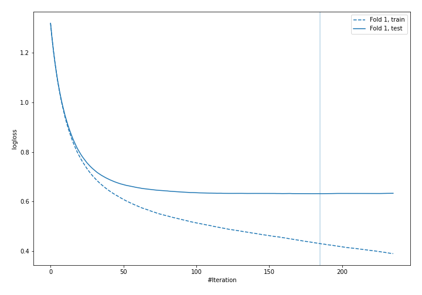
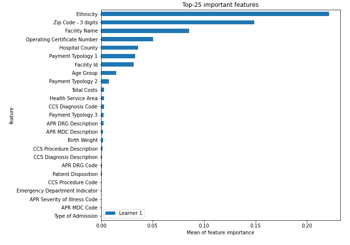
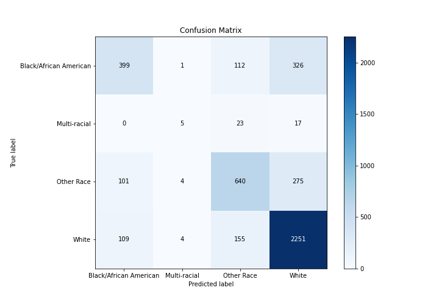
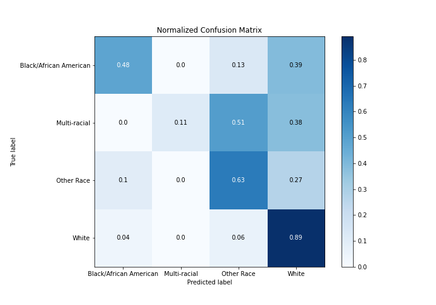
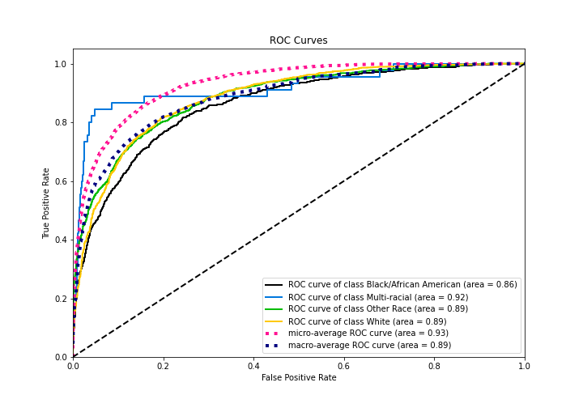
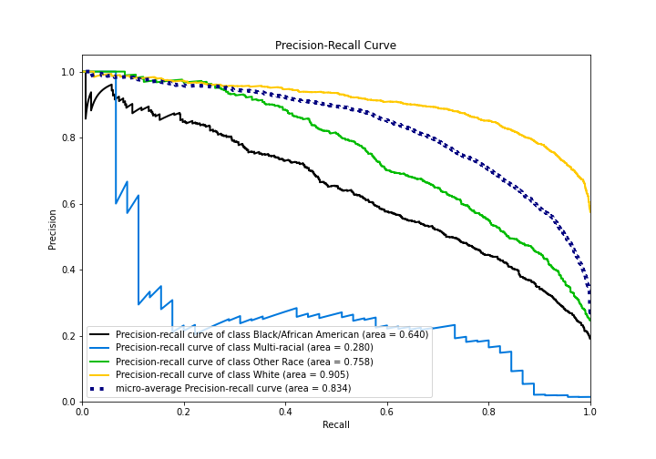
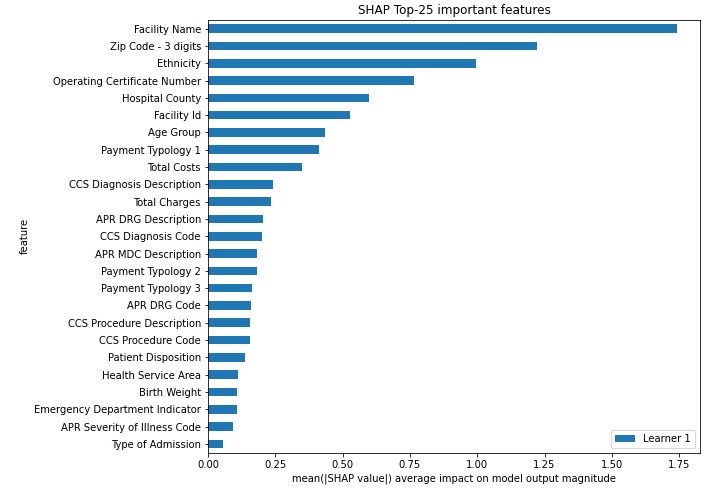

# Summary of 3_Default_Xgboost

[<< Go back](../README.md)

## Extreme Gradient Boosting (Xgboost)
- **n_jobs**: -1
- **objective**: multi:softprob
- **eta**: 0.075
- **max_depth**: 6
- **min_child_weight**: 1
- **subsample**: 1.0
- **colsample_bytree**: 1.0
- **eval_metric**: mlogloss
- **num_class**: 4
- **explain_level**: 2

## Validation
 - **validation_type**: split
 - **train_ratio**: 0.75
 - **shuffle**: True
 - **stratify**: True

## Optimized metric
logloss

## Training time

42.2 seconds

### Metric details
|           |   Black/African American |   Multi-racial |   Other Race |       White |   accuracy |   macro avg |   weighted avg |   logloss |
|:----------|-------------------------:|---------------:|-------------:|------------:|-----------:|------------:|---------------:|----------:|
| precision |                 0.655172 |       0.357143 |     0.688172 |    0.784594 |   0.745138 |    0.62127  |       0.733477 |  0.631893 |
| recall    |                 0.476134 |       0.111111 |     0.627451 |    0.893609 |   0.745138 |    0.527076 |       0.745138 |  0.631893 |
| f1-score  |                 0.551486 |       0.169492 |     0.65641  |    0.835561 |   0.745138 |    0.553237 |       0.733625 |  0.631893 |
| support   |               838        |      45        |  1020        | 2519        |   0.745138 | 4422        |    4422        |  0.631893 |

## Confusion matrix
|                                   |   Predicted as Black/African American |   Predicted as Multi-racial |   Predicted as Other Race |   Predicted as White |
|:----------------------------------|--------------------------------------:|----------------------------:|--------------------------:|---------------------:|
| Labeled as Black/African American |                                   399 |                           1 |                       112 |                  326 |
| Labeled as Multi-racial           |                                     0 |                           5 |                        23 |                   17 |
| Labeled as Other Race             |                                   101 |                           4 |                       640 |                  275 |
| Labeled as White                  |                                   109 |                           4 |                       155 |                 2251 |

## Learning curves

## Permutation-based Importance

## Confusion Matrix

## Normalized Confusion Matrix

## ROC Curve

## Precision Recall Curve

## SHAP Importance

[<< Go back](../README.md)
