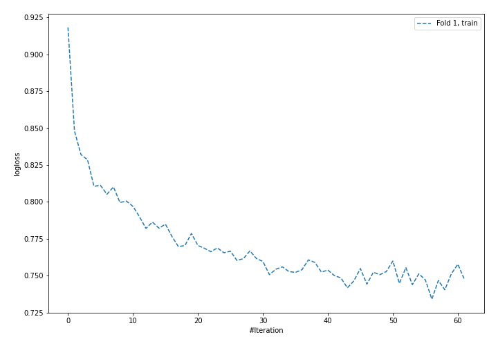
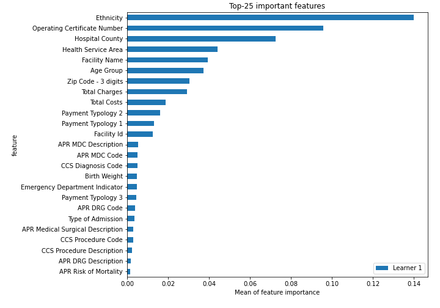
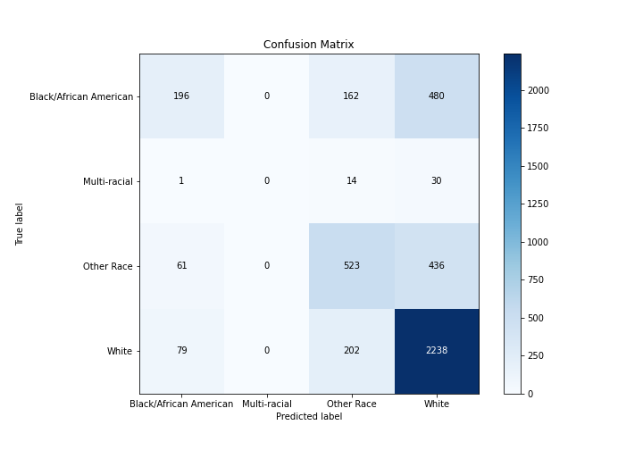
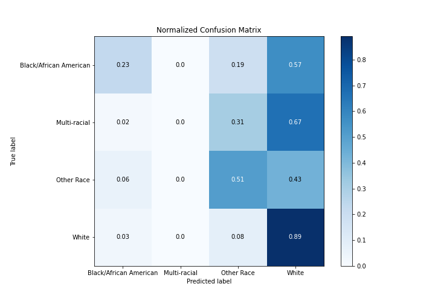
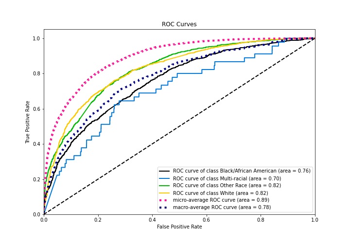
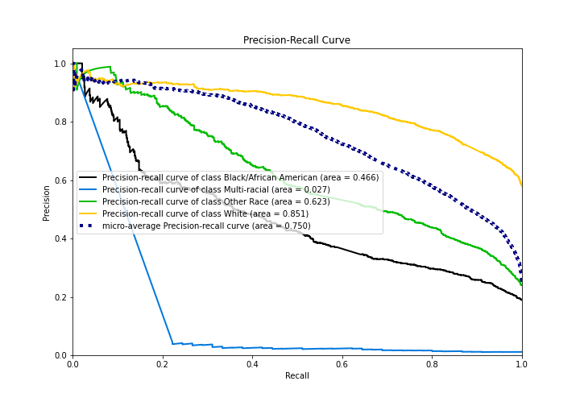

# Summary of 4_Default_NeuralNetwork

[<< Go back](../README.md)

## Neural Network
- **n_jobs**: -1
- **dense_1_size**: 32
- **dense_2_size**: 16
- **learning_rate**: 0.05
- **num_class**: 4
- **explain_level**: 2

## Validation
 - **validation_type**: split
 - **train_ratio**: 0.75
 - **shuffle**: True
 - **stratify**: True

## Optimized metric
logloss

## Training time

8.7 seconds

### Metric details
|           |   Black/African American |   Multi-racial |   Other Race |       White |   accuracy |   macro avg |   weighted avg |   logloss |
|:----------|-------------------------:|---------------:|-------------:|------------:|-----------:|------------:|---------------:|----------:|
| precision |                 0.581602 |              0 |     0.580466 |    0.702889 |   0.668702 |    0.466239 |       0.644513 |  0.795246 |
| recall    |                 0.23389  |              0 |     0.512745 |    0.888448 |   0.668702 |    0.408771 |       0.668702 |  0.795246 |
| f1-score  |                 0.333617 |              0 |     0.544508 |    0.78485  |   0.668702 |    0.415744 |       0.635913 |  0.795246 |
| support   |               838        |             45 |  1020        | 2519        |   0.668702 | 4422        |    4422        |  0.795246 |

## Confusion matrix
|                                   |   Predicted as Black/African American |   Predicted as Multi-racial |   Predicted as Other Race |   Predicted as White |
|:----------------------------------|--------------------------------------:|----------------------------:|--------------------------:|---------------------:|
| Labeled as Black/African American |                                   196 |                           0 |                       162 |                  480 |
| Labeled as Multi-racial           |                                     1 |                           0 |                        14 |                   30 |
| Labeled as Other Race             |                                    61 |                           0 |                       523 |                  436 |
| Labeled as White                  |                                    79 |                           0 |                       202 |                 2238 |

## Learning curves

## Permutation-based Importance

## Confusion Matrix

## Normalized Confusion Matrix

## ROC Curve

## Precision Recall Curve

[<< Go back](../README.md)
