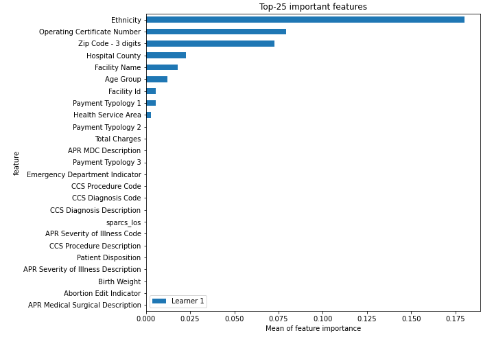

# Summary of 5_Default_RandomForest

[<< Go back](../README.md)

## Random Forest
- **n_jobs**: -1
- **criterion**: gini
- **max_features**: 0.9
- **min_samples_split**: 30
- **max_depth**: 4
- **eval_metric_name**: logloss
- **num_class**: 4
- **explain_level**: 2

## Validation
 - **validation_type**: split
 - **train_ratio**: 0.75
 - **shuffle**: True
 - **stratify**: True

## Optimized metric
logloss

## Training time

45.4 seconds

### Metric details
|           |   Black/African American |   Multi-racial |   Other Race |       White |   accuracy |   macro avg |   weighted avg |   logloss |
|:----------|-------------------------:|---------------:|-------------:|------------:|-----------:|------------:|---------------:|----------:|
| precision |                 0.577348 |              0 |     0.661743 |    0.684008 |   0.671868 |    0.480775 |       0.651699 |  0.768391 |
| recall    |                 0.249403 |              0 |     0.439216 |    0.918618 |   0.671868 |    0.401809 |       0.671868 |  0.768391 |
| f1-score  |                 0.348333 |              0 |     0.527991 |    0.784141 |   0.671868 |    0.415116 |       0.634488 |  0.768391 |
| support   |               838        |             45 |  1020        | 2519        |   0.671868 | 4422        |    4422        |  0.768391 |

## Confusion matrix
|                                   |   Predicted as Black/African American |   Predicted as Multi-racial |   Predicted as Other Race |   Predicted as White |
|:----------------------------------|--------------------------------------:|----------------------------:|--------------------------:|---------------------:|
| Labeled as Black/African American |                                   209 |                           0 |                        76 |                  553 |
| Labeled as Multi-racial           |                                     0 |                           0 |                        11 |                   34 |
| Labeled as Other Race             |                                    90 |                           0 |                       448 |                  482 |
| Labeled as White                  |                                    63 |                           0 |                       142 |                 2314 |

## Learning curves

## Permutation-based Importance

## Confusion Matrix

## Normalized Confusion Matrix

## ROC Curve

## Precision Recall Curve

## SHAP Importance

[<< Go back](../README.md)
