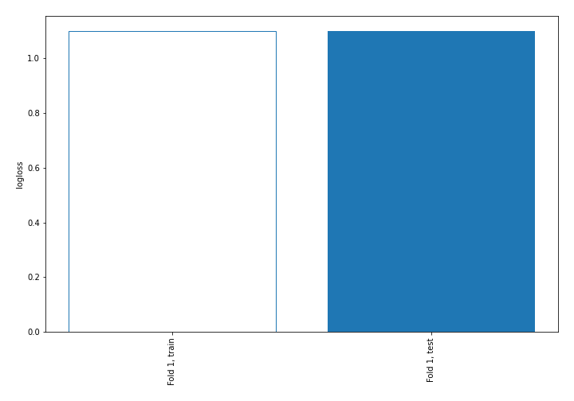
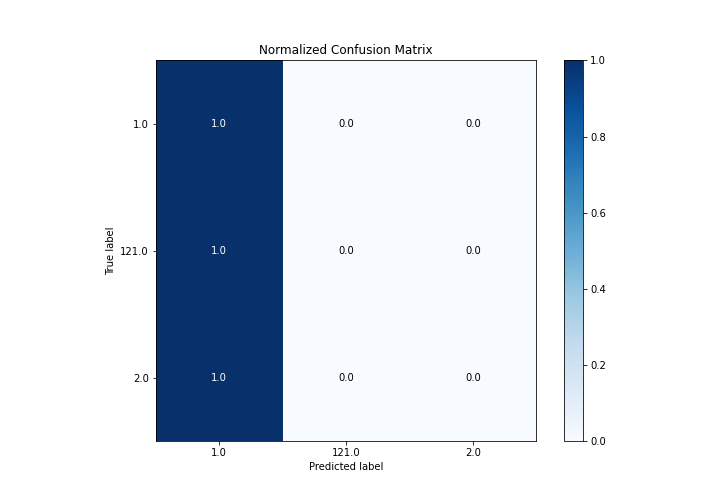
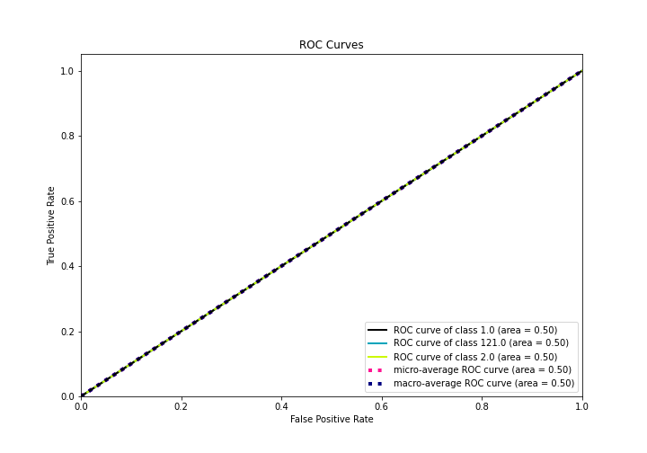
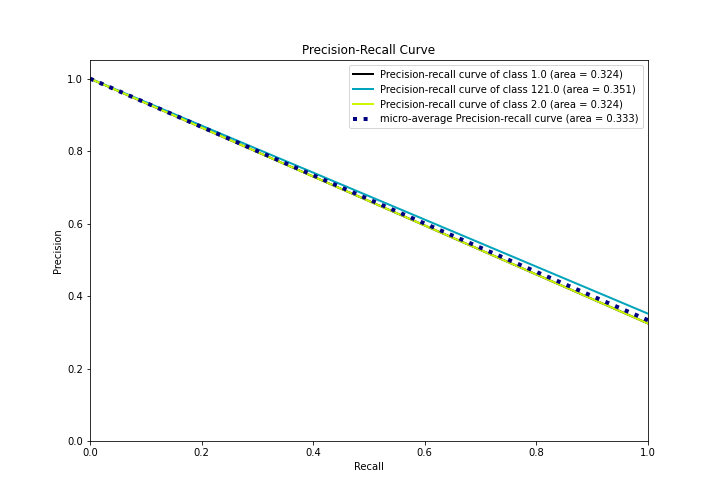

# Summary of 1_Baseline

[<< Go back](../README.md)

## Baseline Classifier (Baseline)
- **n_jobs**: -1
- **num_class**: 3
- **explain_level**: 2

## Validation
 - **validation_type**: split
 - **train_ratio**: 0.75
 - **shuffle**: True
 - **stratify**: True

## Optimized metric
logloss

## Training time

1.5 seconds

### Metric details
|           |       1.0 |   2.0 |   121.0 |   accuracy |   macro avg |   weighted avg |   logloss |
|:----------|----------:|------:|--------:|-----------:|------------:|---------------:|----------:|
| precision |  0.324324 |     0 |       0 |   0.324324 |    0.108108 |       0.105186 |   1.09861 |
| recall    |  1        |     0 |       0 |   0.324324 |    0.333333 |       0.324324 |   1.09861 |
| f1-score  |  0.489796 |     0 |       0 |   0.324324 |    0.163265 |       0.158853 |   1.09861 |
| support   | 12        |    12 |      13 |   0.324324 |   37        |      37        |   1.09861 |

## Confusion matrix
|                  |   Predicted as 1.0 |   Predicted as 2.0 |   Predicted as 121.0 |
|:-----------------|-------------------:|-------------------:|---------------------:|
| Labeled as 1.0   |                 12 |                  0 |                    0 |
| Labeled as 2.0   |                 12 |                  0 |                    0 |
| Labeled as 121.0 |                 13 |                  0 |                    0 |

## Learning curves

## Confusion Matrix

## Normalized Confusion Matrix

## ROC Curve

## Precision Recall Curve

[<< Go back](../README.md)
