# Summary of 2_DecisionTree

[<< Go back](../README.md)

## Decision Tree
- **n_jobs**: -1
- **criterion**: gini
- **max_depth**: 3
- **num_class**: 3
- **explain_level**: 2

## Validation
 - **validation_type**: split
 - **train_ratio**: 0.75
 - **shuffle**: True
 - **stratify**: True

## Optimized metric
logloss

## Training time

6.8 seconds

### Metric details
|           |   1.0 |       2.0 |     121.0 |   accuracy |   macro avg |   weighted avg |   logloss |
|:----------|------:|----------:|----------:|-----------:|------------:|---------------:|----------:|
| precision |     1 |  0.9      |  0.8      |   0.891892 |    0.9      |       0.897297 |   1.50006 |
| recall    |     1 |  0.75     |  0.923077 |   0.891892 |    0.891026 |       0.891892 |   1.50006 |
| f1-score  |     1 |  0.818182 |  0.857143 |   0.891892 |    0.891775 |       0.890839 |   1.50006 |
| support   |    12 | 12        | 13        |   0.891892 |   37        |      37        |   1.50006 |

## Confusion matrix
|                  |   Predicted as 1.0 |   Predicted as 2.0 |   Predicted as 121.0 |
|:-----------------|-------------------:|-------------------:|---------------------:|
| Labeled as 1.0   |                 12 |                  0 |                    0 |
| Labeled as 2.0   |                  0 |                  9 |                    3 |
| Labeled as 121.0 |                  0 |                  1 |                   12 |

## Learning curves
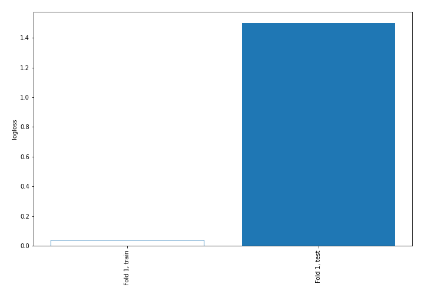

## Decision Tree 

### Tree #1
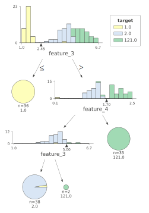

### Rules

if (feature_3 > 2.45) and (feature_4 <= 1.7) and (feature_3 <= 5.0) then class: 2.0 (proba: 97.37%) | based on 38 samples

if (feature_3 <= 2.45) then class: 1.0 (proba: 100.0%) | based on 36 samples

if (feature_3 > 2.45) and (feature_4 > 1.7) then class: 121.0 (proba: 100.0%) | based on 35 samples

if (feature_3 > 2.45) and (feature_4 <= 1.7) and (feature_3 > 5.0) then class: 121.0 (proba: 100.0%) | based on 2 samples

## Permutation-based Importance
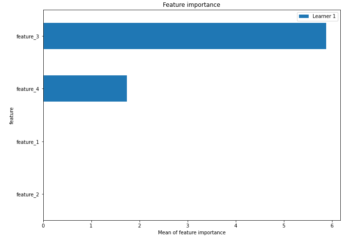
## Confusion Matrix

## Normalized Confusion Matrix

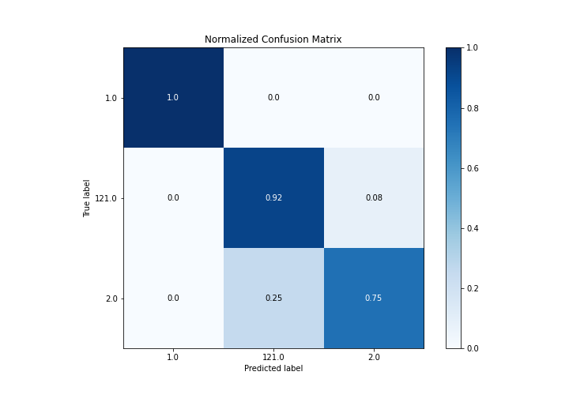

## ROC Curve

## Precision Recall Curve

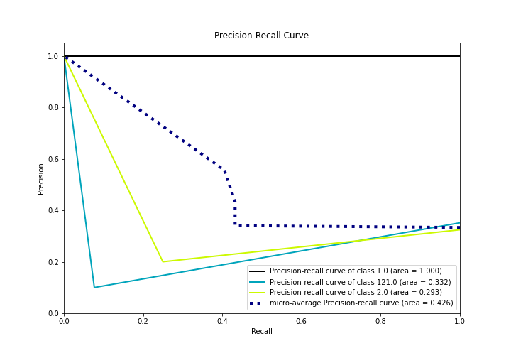

## SHAP Importance
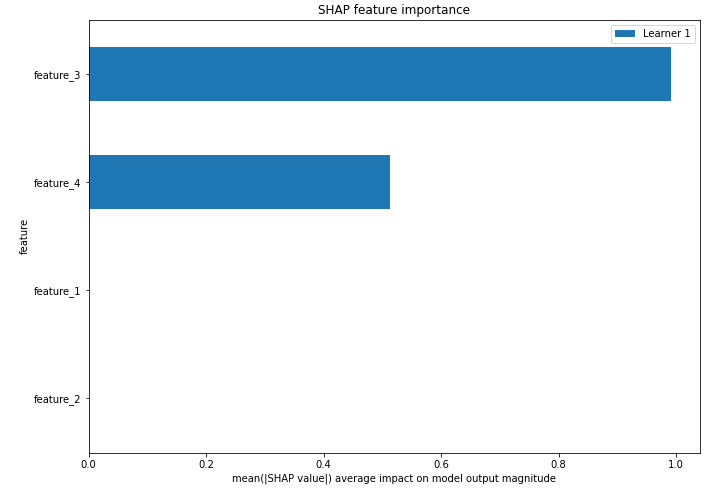

## SHAP Dependence plots

### Dependence 1.0 (Fold 1)
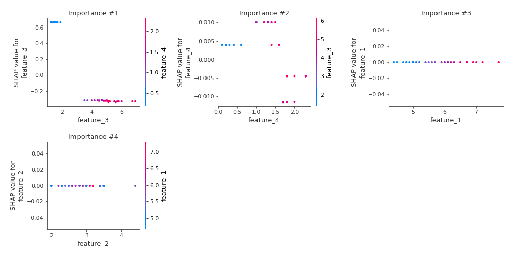
### Dependence 121.0 (Fold 1)
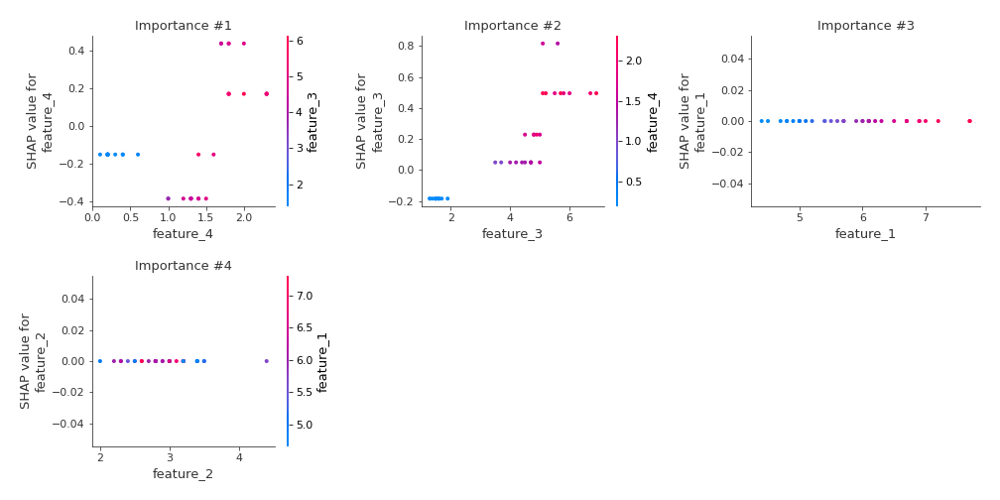
### Dependence 2.0 (Fold 1)

## SHAP Decision plots

### Worst decisions for selected sample 1 (Fold 1)

### Worst decisions for selected sample 2 (Fold 1)

### Worst decisions for selected sample 3 (Fold 1)
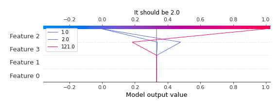
### Worst decisions for selected sample 4 (Fold 1)
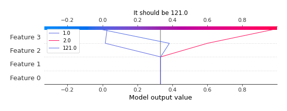
### Best decisions for selected sample 1 (Fold 1)

### Best decisions for selected sample 2 (Fold 1)

### Best decisions for selected sample 3 (Fold 1)

### Best decisions for selected sample 4 (Fold 1)
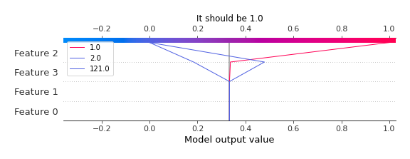

[<< Go back](../README.md)
