# Summary of 3_Linear

[<< Go back](../README.md)

## Logistic Regression (Linear)
- **n_jobs**: -1
- **num_class**: 3
- **explain_level**: 2

## Validation
 - **validation_type**: split
 - **train_ratio**: 0.75
 - **shuffle**: True
 - **stratify**: True

## Optimized metric
logloss

## Training time

5.4 seconds

### Metric details
|           |   1.0 |       2.0 |     121.0 |   accuracy |   macro avg |   weighted avg |   logloss |
|:----------|------:|----------:|----------:|-----------:|------------:|---------------:|----------:|
| precision |     1 |  0.769231 |  0.833333 |   0.864865 |    0.867521 |       0.866597 |  0.252079 |
| recall    |     1 |  0.833333 |  0.769231 |   0.864865 |    0.867521 |       0.864865 |  0.252079 |
| f1-score  |     1 |  0.8      |  0.8      |   0.864865 |    0.866667 |       0.864865 |  0.252079 |
| support   |    12 | 12        | 13        |   0.864865 |   37        |      37        |  0.252079 |

## Confusion matrix
|                  |   Predicted as 1.0 |   Predicted as 2.0 |   Predicted as 121.0 |
|:-----------------|-------------------:|-------------------:|---------------------:|
| Labeled as 1.0   |                 12 |                  0 |                    0 |
| Labeled as 2.0   |                  0 |                 10 |                    2 |
| Labeled as 121.0 |                  0 |                  3 |                   10 |

## Learning curves
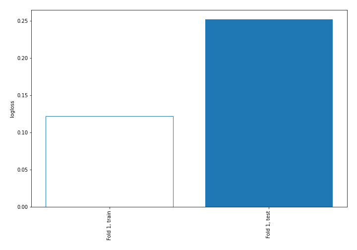

## Coefficients

### Coefficients learner #1
|           |       1.0 |       2.0 |     121.0 |
|:----------|----------:|----------:|----------:|
| intercept | -0.184156 |  1.74716  | -1.563    |
| feature_1 | -1.12769  |  0.4638   |  0.663894 |
| feature_2 |  1.17961  | -0.639062 | -0.540545 |
| feature_3 | -1.63332  | -0.270226 |  1.90355  |
| feature_4 | -1.53522  | -0.847727 |  2.38295  |

## Permutation-based Importance
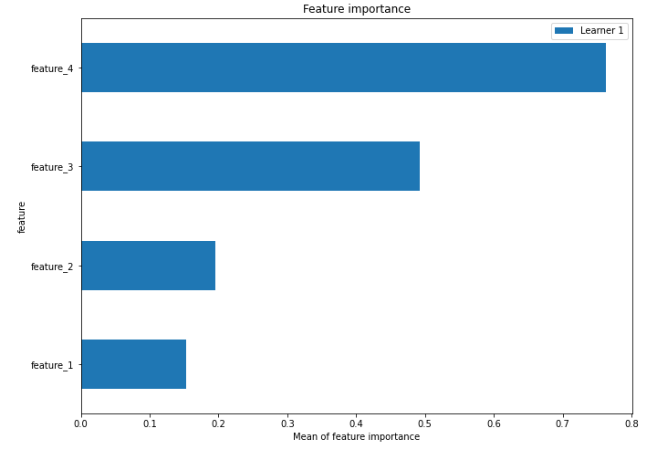
## Confusion Matrix

## Normalized Confusion Matrix

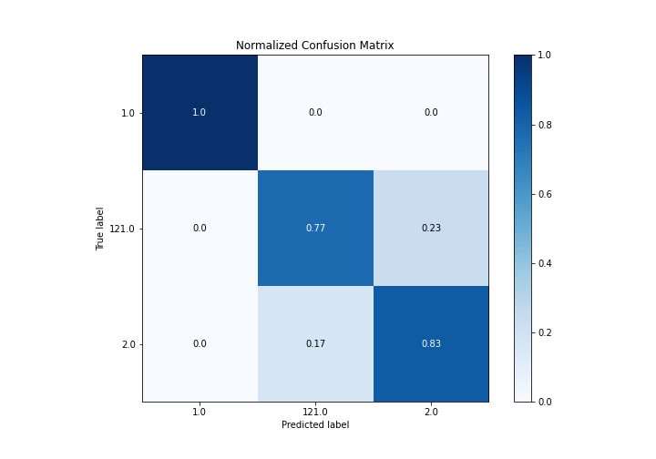

## ROC Curve

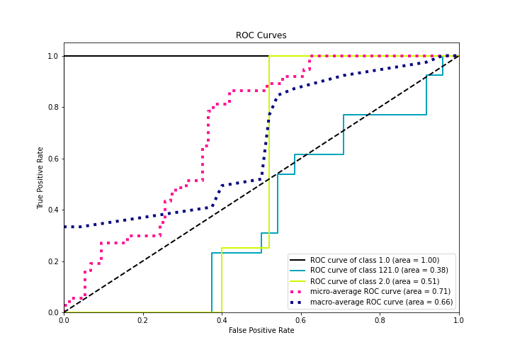

## Precision Recall Curve

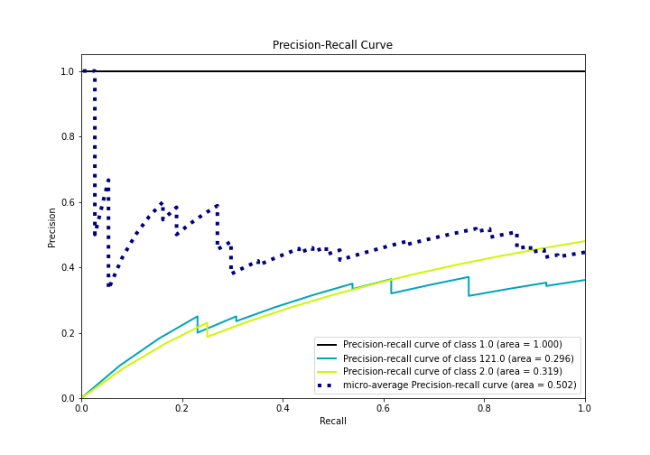

## SHAP Importance
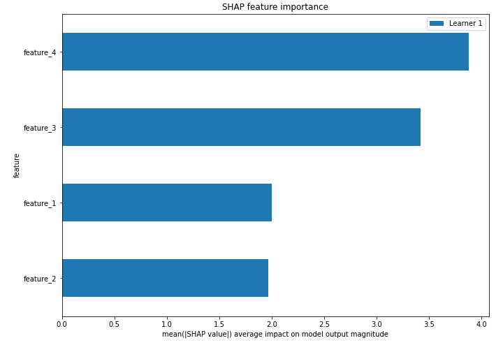

## SHAP Dependence plots

### Dependence 1.0 (Fold 1)
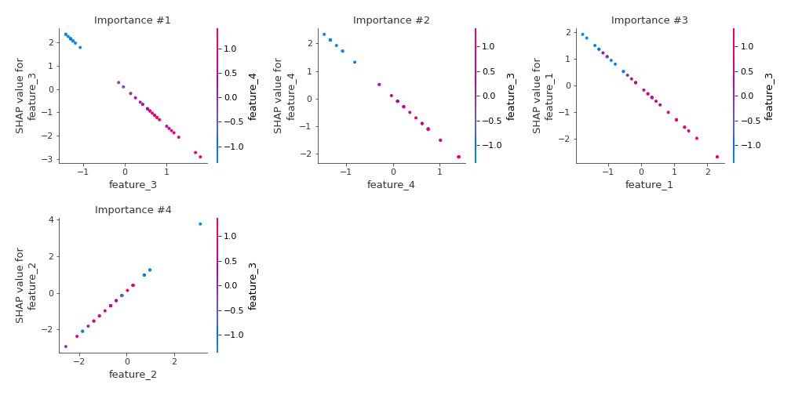
### Dependence 121.0 (Fold 1)
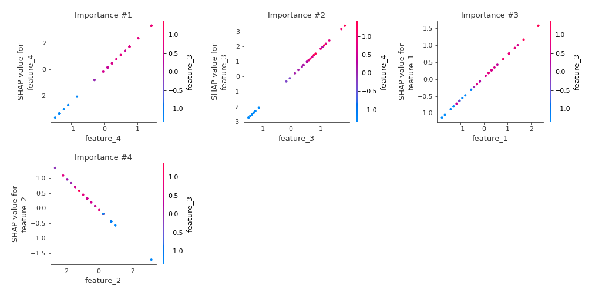
### Dependence 2.0 (Fold 1)
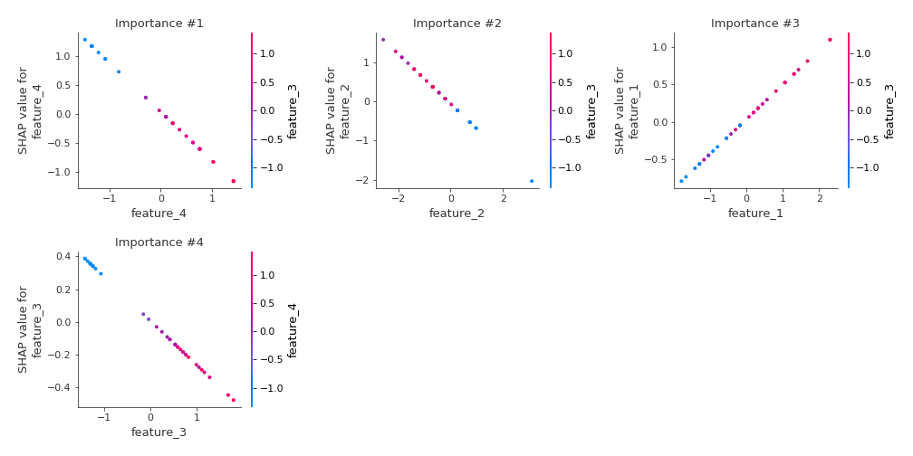

## SHAP Decision plots

### Worst decisions for selected sample 1 (Fold 1)
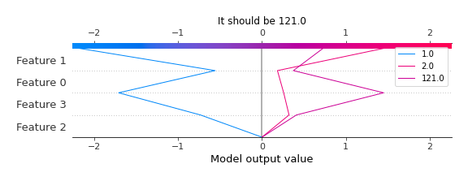
### Worst decisions for selected sample 2 (Fold 1)
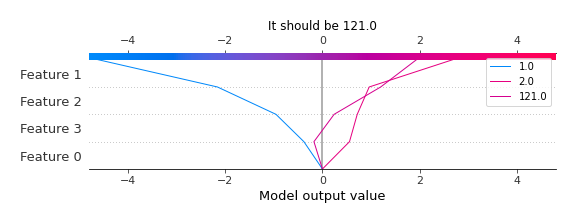
### Worst decisions for selected sample 3 (Fold 1)
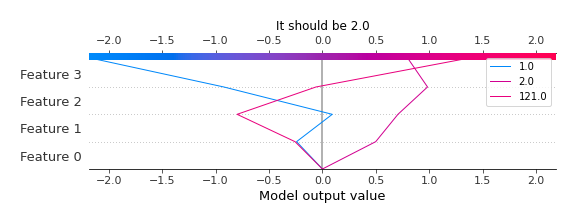
### Worst decisions for selected sample 4 (Fold 1)
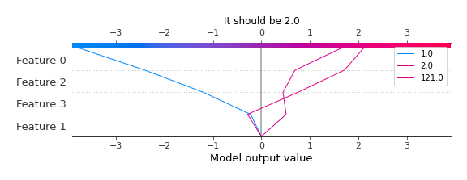
### Best decisions for selected sample 1 (Fold 1)

### Best decisions for selected sample 2 (Fold 1)
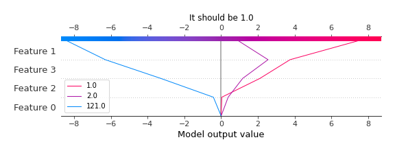
### Best decisions for selected sample 3 (Fold 1)
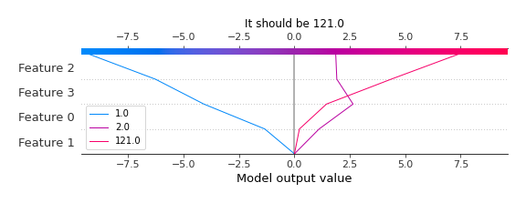
### Best decisions for selected sample 4 (Fold 1)
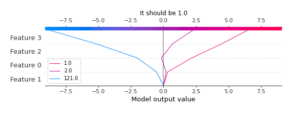

[<< Go back](../README.md)
