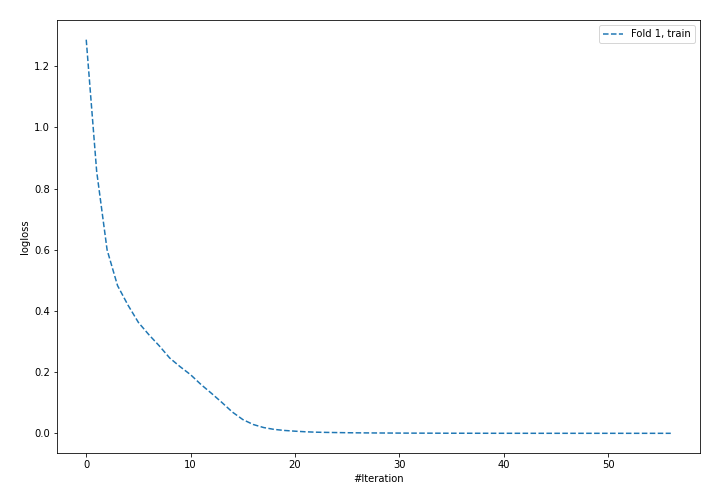
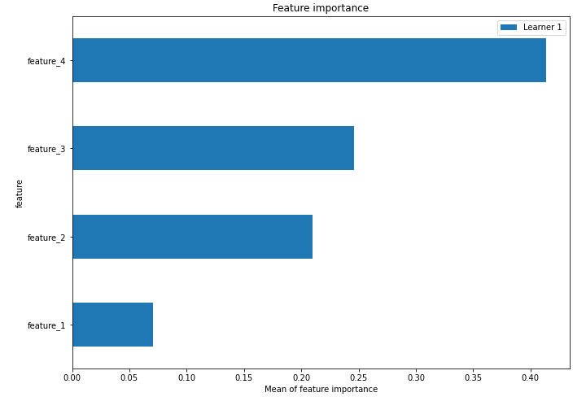
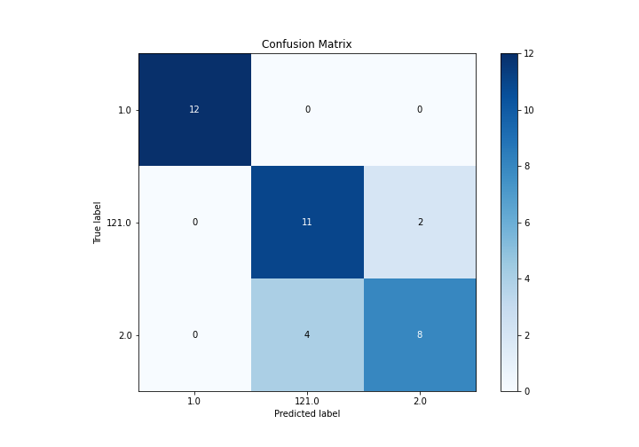
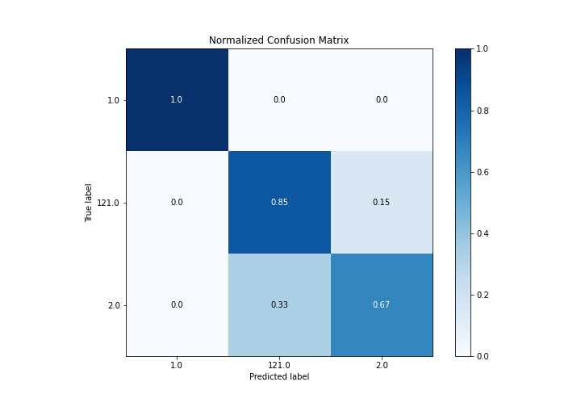
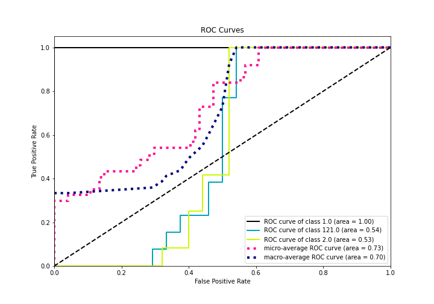
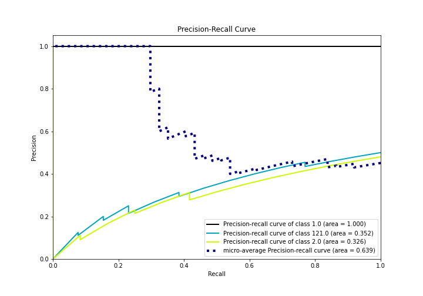

# Summary of 5_Default_NeuralNetwork

[<< Go back](../README.md)

## Neural Network
- **n_jobs**: -1
- **dense_1_size**: 32
- **dense_2_size**: 16
- **learning_rate**: 0.05
- **num_class**: 3
- **explain_level**: 2

## Validation
 - **validation_type**: split
 - **train_ratio**: 0.75
 - **shuffle**: True
 - **stratify**: True

## Optimized metric
logloss

## Training time

1.2 seconds

### Metric details
|           |   1.0 |       2.0 |     121.0 |   accuracy |   macro avg |   weighted avg |   logloss |
|:----------|------:|----------:|----------:|-----------:|------------:|---------------:|----------:|
| precision |     1 |  0.8      |  0.733333 |   0.837838 |    0.844444 |       0.841441 |  0.404506 |
| recall    |     1 |  0.666667 |  0.846154 |   0.837838 |    0.837607 |       0.837838 |  0.404506 |
| f1-score  |     1 |  0.727273 |  0.785714 |   0.837838 |    0.837662 |       0.836258 |  0.404506 |
| support   |    12 | 12        | 13        |   0.837838 |   37        |      37        |  0.404506 |

## Confusion matrix
|                  |   Predicted as 1.0 |   Predicted as 2.0 |   Predicted as 121.0 |
|:-----------------|-------------------:|-------------------:|---------------------:|
| Labeled as 1.0   |                 12 |                  0 |                    0 |
| Labeled as 2.0   |                  0 |                  8 |                    4 |
| Labeled as 121.0 |                  0 |                  2 |                   11 |

## Learning curves

## Permutation-based Importance

## Confusion Matrix

## Normalized Confusion Matrix

## ROC Curve

## Precision Recall Curve

[<< Go back](../README.md)
