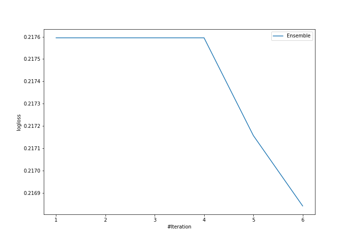
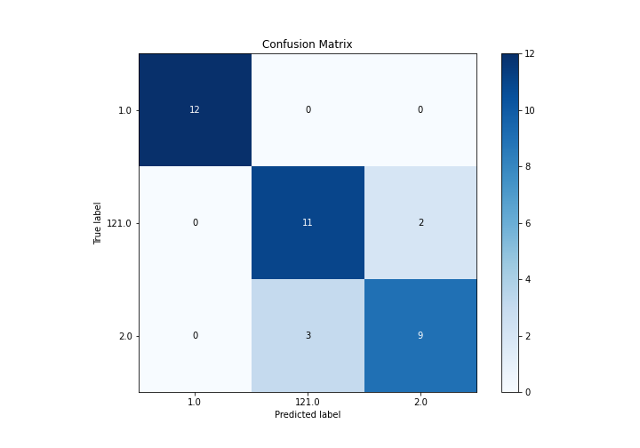
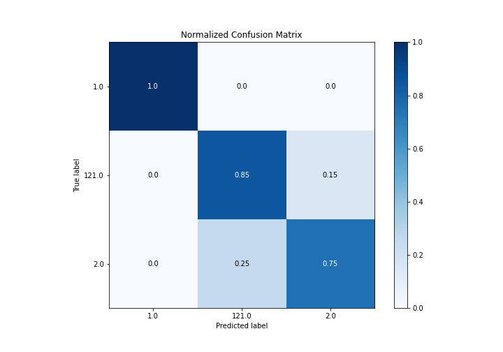
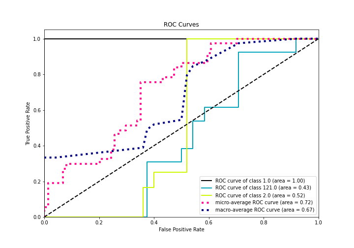
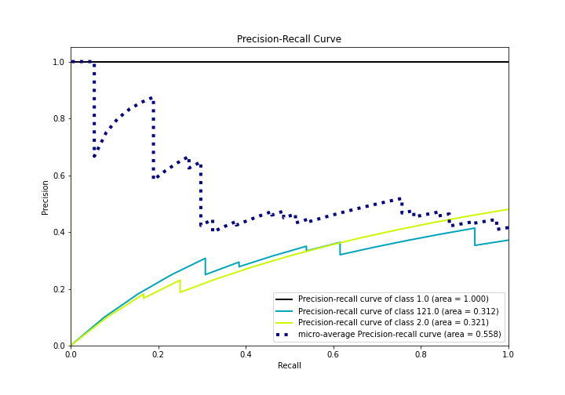

# Summary of Ensemble

[<< Go back](../README.md)

## Ensemble structure
| Model                  |   Weight |
|:-----------------------|---------:|
| 3_Linear               |        1 |
| 6_Default_RandomForest |        5 |

### Metric details
|           |   1.0 |       2.0 |     121.0 |   accuracy |   macro avg |   weighted avg |   logloss |
|:----------|------:|----------:|----------:|-----------:|------------:|---------------:|----------:|
| precision |     1 |  0.818182 |  0.785714 |   0.864865 |    0.867965 |       0.865742 |  0.216842 |
| recall    |     1 |  0.75     |  0.846154 |   0.864865 |    0.865385 |       0.864865 |  0.216842 |
| f1-score  |     1 |  0.782609 |  0.814815 |   0.864865 |    0.865808 |       0.86443  |  0.216842 |
| support   |    12 | 12        | 13        |   0.864865 |   37        |      37        |  0.216842 |

## Confusion matrix
|                  |   Predicted as 1.0 |   Predicted as 2.0 |   Predicted as 121.0 |
|:-----------------|-------------------:|-------------------:|---------------------:|
| Labeled as 1.0   |                 12 |                  0 |                    0 |
| Labeled as 2.0   |                  0 |                  9 |                    3 |
| Labeled as 121.0 |                  0 |                  2 |                   11 |

## Learning curves

## Confusion Matrix

## Normalized Confusion Matrix

## ROC Curve

## Precision Recall Curve

[<< Go back](../README.md)
